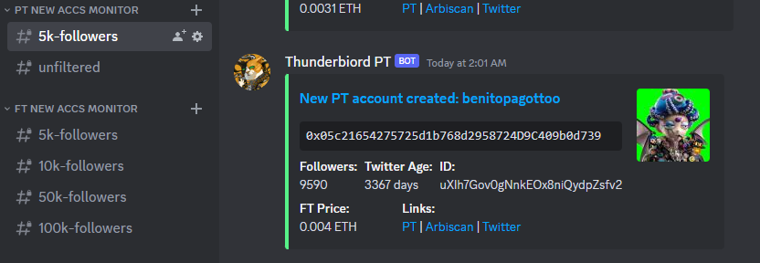

# 🖥️ Monitors

All holders of at least one of my friend.tech shares get access to the share holder discord which has friend.tech monitors that can be paired with the bot for optimal use. The current monitors offered: \
\
New FT Accounts (Public):

<figure><figcaption></figcaption></figure>

This monitor scans friend.tech for newly created accounts and then sends a webhook to the appropriate channel based on follower count. It is important to keep in mind that this monitor finds accounts as soon as they are created not as soon as they buy the first share. So some of the accounts may not be live and purchasable immediately. Because of this the new accounts monitors are best paired with the [share-sniper.md](../cli-bot-private/share-sniper.md "mention").

FT Self-Buy (Public):

<figure><figcaption></figcaption></figure>

This monitor scans friend.tech for accounts with over 1 eth to start buying their own shares. This info allows you to buy into shares before a user pumps their own price.&#x20;

New PT Accounts (Public):

<figure><figcaption></figcaption></figure>

This monitor scans post.tech for newly created accounts and then sends a webhook to the shareholder discord. This monitor is best paired with [pt-buy-sell.md](pt-buy-sell.md "mention") to buy and sell post.tech shares directly from Discord.

FT Deposits (Private):

<figure><figcaption></figcaption></figure>

This monitor scans for friend.tech accounts to add eth to their wallet. Once eth is added a webhook is sent either to the filtered (over 1 eth deposited) or unfiltered channel.

Note:

If there is a specific monitor you would like to see added let me know in the Discord server or friend.tech chat.&#x20;

